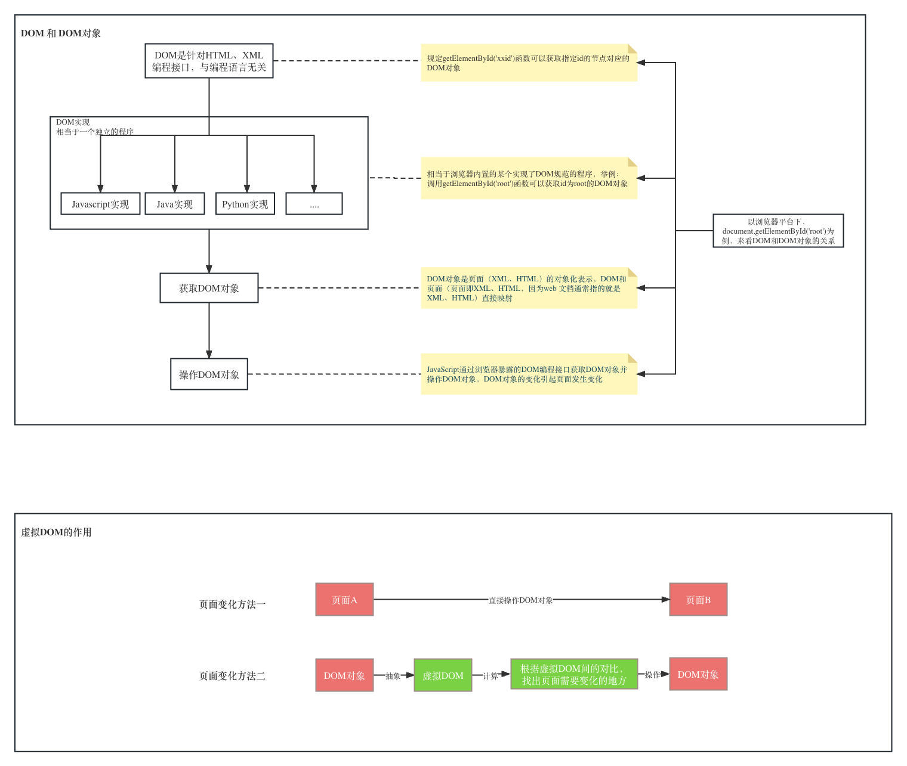

### What is DOM?
[DOM(Document Object Model)](https://developer.mozilla.org/en-US/docs/Web/API/Document_Object_Model/Introduction) is a programming interface for HTML and XML documents. It represents the page so that programs can change the document structure, style, and content. The DOM represents the document as nodes and objects. That way, programming languages can connect to the page.
### What is Virtual DOM?
[Virtual DOM](https://reactjs.org/docs/faq-internals.html) is a programming concept where an ideal, or “virtual”, representation of a UI is kept in memory and synced with the “real” DOM by a library such as ReactDOM. This process is called reconciliation. This approach enables the declarative API of React: You tell React what state you want the UI to be in, and it makes sure the DOM matches that state. This abstracts out the attribute manipulation, event handling, and manual DOM updating that you would otherwise have to use to build your app.

### What is JSX?
[JSX](https://react.dev/learn/writing-markup-with-jsx) is a syntax extension for JavaScript that lets you write HTML-like markup inside a JavaScript file. Although there are other ways to write components, most React developers prefer the conciseness of JSX, and most codebases use it. Can also use React.createElement() to create React elements(virtual DOM).

